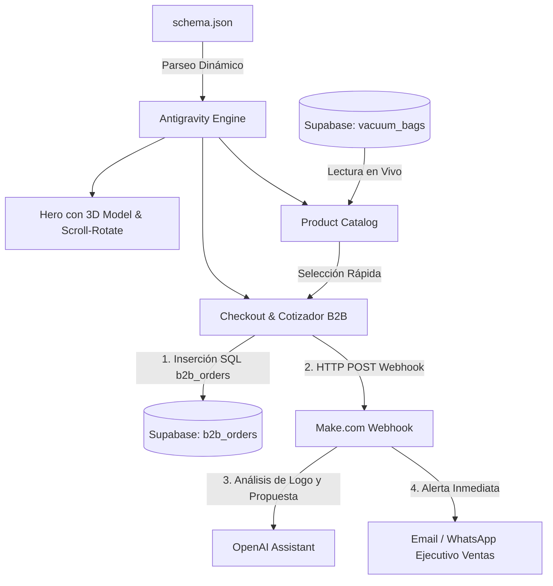

# WellPack Biobío - Plataforma B2B de Empaques al Vacío

Plataforma B2B de alto rendimiento orientada a plantas procesadoras de pescados y mariscos en la Región del Biobío (Talcahuano, Coronel, San Vicente). 

El frontend se renderiza de forma 100% dinámica interpretando el archivo `schema.json` mediante el motor **Antigravity Renderer**, consumiendo datos en tiempo real de **Supabase** y disparando automatizaciones a **Make.com** con soporte de **OpenAI**.

---

## 🏗️ Arquitectura Técnica



---

## 🚀 Inicio Rápido (Local)

Para probar la plataforma en tu navegador:

```bash
# Puedes utilizar el servidor HTTP de Python:
python -m http.server 8080
```

Luego abre en tu navegador: [http://localhost:8080](http://localhost:8080)

---

## 🗄️ 1. Configuración de Base de Datos (Supabase)

1. Ingresa a tu proyecto en [Supabase](https://supabase.com/).
2. Ve al **SQL Editor**.
3. Copia y ejecuta el contenido del archivo `supabase_schema.sql`. Este script creará:
   - Tabla `vacuum_bags` (con los formatos `40x25` y `36x20`).
   - Tabla `b2b_orders` (para almacenar las cotizaciones de las plantas).
   - Políticas RLS para lectura pública e inserción de órdenes.

---

## ⚡ 2. Configuración de Make.com + OpenAI

1. En **Make.com**, crea un nuevo escenario con el trigger **Custom Webhook**.
2. Copia la URL generada (ej: `https://hook.eu1.make.com/...`).
3. Agrega un módulo **OpenAI (Create a Completion / Chat Completion)**:
   - Recibirá el payload con las especificaciones del empaque, tiraje y logotipo.
   - Generará la propuesta técnica y borrador de cotización formal para la planta procesadora.
4. Conecta el paso final para notificar al equipo comercial por correo o Slack/WhatsApp.

---

## ⚙️ 3. Conexión de Credenciales en la Web

Puedes ingresar tus credenciales directamente desde la interfaz web haciendo clic en el **icono de engranaje (⚙️)** en la barra superior:
- **Supabase Project URL**
- **Supabase Anon Public Key**
- **Make.com Webhook URL**

Los cambios se guardan de forma persistente y segura en tu navegador (`localStorage`) o puedes editarlos en `config.js`.
